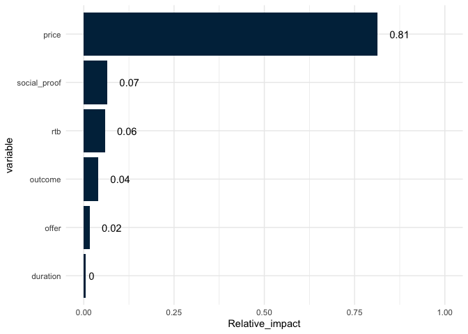
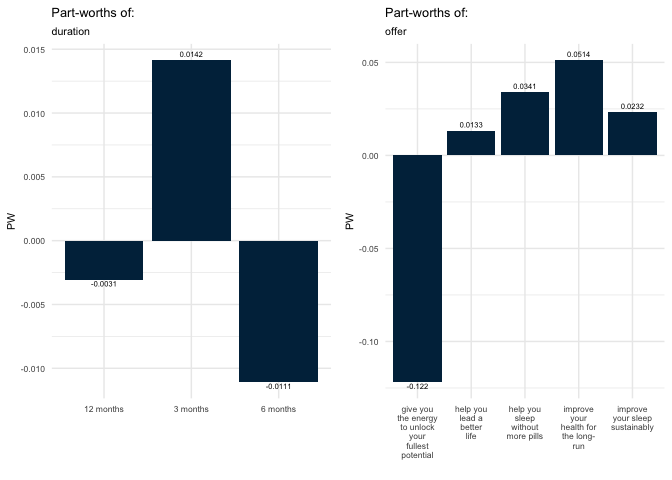
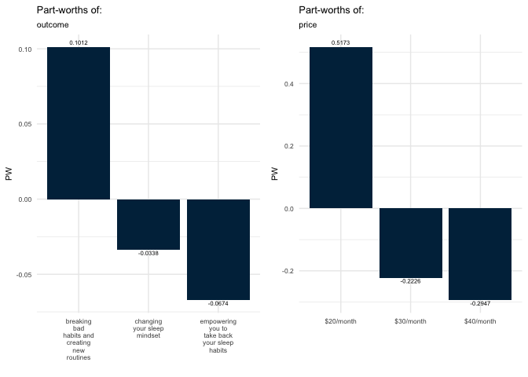
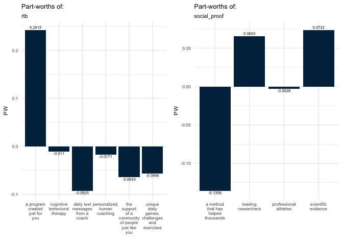
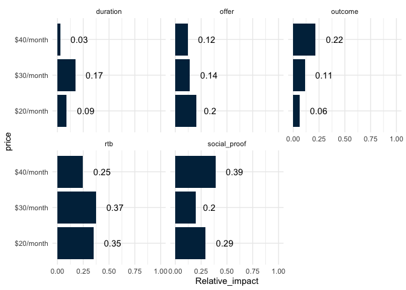

``` r
# Data Input
experiment_data <-  read_sav('data/experiment_data.sav')
survey_data <-  read_sav('data/survey_data.sav')

#Split the survey data based on their characteristics
survey_source <-
  survey_data %>%
  dplyr::select(response_id, contains('source'))

survey_behavior <-
  survey_data %>%
  dplyr::select(response_id, contains('behavior'))

survey_other <-
  survey_data %>%
  dplyr::select(response_id, interst_cbt:interest_coach)

survey_demo <-
  survey_data %>%
  dplyr::select(response_id, d_urban:s_problem, d_marital:weights)

survey_philosophy <-
  survey_data %>%
  dplyr::select(response_id, contains('m1_philosophy'))
```

### 1. Data checking, missing and deuplicated data

``` r
#Check is there any missing data or any duplicated data

#Duplication check
duplicate_survey_data<-survey_data%>%
  group_by(response_id)%>%
  summarise(count = n())%>%
  filter(count > 1)

print(nrow(duplicate_survey_data))
```

    ## [1] 0

There is no duplicated data in the survey data

``` r
#Check if there is any Duplicated data for experiment data

duplicate_experiment_data<-experiment_data%>%
  group_by(response_id, duration,offer, outcome, price, rtb, social_proof)%>%
  dplyr::summarise(count = n())%>%
  filter(count > 1)

print(nrow(duplicate_experiment_data))
```

    ## [1] 20

As there are duplicared data in the experiment dataset, the next step is
to check whether they are consitent or not.

``` r
# Merge the dataset for consitent checking
duplicate_experiment_data2<-duplicate_experiment_data%>%
  ungroup()%>%
  mutate(case = row_number())%>%
  left_join(experiment_data, c('response_id', 'duration','offer', 'outcome', 'price', 'rtb', 'social_proof'))

#Figure out cases that with contradict answer given same combination
contradict_case = duplicate_experiment_data2%>%
  dplyr::select(case, answer)%>%
  unique()%>%
  group_by(case)%>%
  summarise(count = n())%>%
  filter(count > 1)

print(paste0("There are ",nrow(contradict_case), " occasions that there is contradiction between choices of the respondent, same questions but different answer"))
```

    ## [1] "There are 3 occasions that there is contradiction between choices of the respondent, same questions but different answer"

Because their answer is inconsistnet, the respondent are not rational in
this research. I would remove them from the analysis.

``` r
#Select those ID which have contradict answer as they are not reliable
id_to_remove = duplicate_experiment_data2%>%
  filter(case %in% contradict_case$case)%>%
  dplyr::select(response_id)%>%
  unique()

#Remove duplicated case and contradict respondent
experiment_data_dedup_decon = experiment_data%>%
  filter(! response_id %in% id_to_remove$response_id)%>%
  dplyr::select(-task)%>%
  unique()
```

### 2. Descriptive Data analysis

``` r
#Distribution plot for all the attributes in experiment data

distribution_plot = function(data, ...){
  ans_dist<- data%>%
    group_by(..., answer)%>%
    dplyr::summarise(count = n())%>%
    group_by(...)%>%
    mutate(percent_count = count / sum(count))%>%
    dplyr::select(-count)%>%
    mutate(answer = as.factor(answer))
  
  ggplot(ans_dist, aes(x = ..., y = percent_count, fill = answer))+
    geom_bar(stat = "identity")+
    scale_fill_brewer(palette="Accent")+
    theme_minimal()+
    theme(text = element_text(size =8))
}

experiment_data_dedup_decon_plot<-experiment_data_dedup_decon%>%
  mutate(offer        = str_wrap(offer, 10),
         outcome      = str_wrap(outcome, 10),
         rtb          = str_wrap(rtb, 10),
         social_proof = str_wrap(social_proof, 10))

ans_dist_plot_1 <- distribution_plot(experiment_data_dedup_decon_plot, duration)
ans_dist_plot_2 <- distribution_plot(experiment_data_dedup_decon_plot, offer)
ans_dist_plot_3 <- distribution_plot(experiment_data_dedup_decon_plot, outcome)
ans_dist_plot_4 <- distribution_plot(experiment_data_dedup_decon_plot, rtb)
ans_dist_plot_5 <- distribution_plot(experiment_data_dedup_decon_plot, social_proof)
ans_dist_plot_6 <- distribution_plot(experiment_data_dedup_decon_plot, price)


egg::ggarrange(ans_dist_plot_1, ans_dist_plot_2, ncol = 2)
```


``` r
egg::ggarrange(ans_dist_plot_3, ans_dist_plot_4, ncol = 2)
```


``` r
egg::ggarrange(ans_dist_plot_5, ans_dist_plot_6, ncol = 2)
```


Based on above distribution plot, the distribution of the answer for
duration and offer don’t have much variation For outcome, “breaking bad
habits and creating new rountines” have more very likely and somewhat
likely to download For rtb, wiht pharses “daily text messages from a
coach” is less likely to download For social proof, “Scientific
evidence” and “leading researchers” are preferred over the other 2 While
for price, $20/month is much more attractive than the other 2 plans

There aren’t much changes in ordering when we combing 3&4 and 1&2 except
for duration. So I would keep it at 4 levels at the initial stage

### 3. Modelling the data

### 3a. Initial conjoint model with lm

Conjoint with the ordiary sacle is used to analyise the relative impact
of each variables

``` r
#Convert all the variables to factor 
experiment_data_dedup_decon[,2:7] <- lapply(experiment_data_dedup_decon[,2:7], factor)

#Built the first model using conjoint
model_cj<-lm(answer ~ duration+offer+outcome+price+rtb+social_proof,
           data = experiment_data_dedup_decon)

#Calculate relative Impact of the model
relImp <- calc.relimp(model_cj, type =c("lmg"), rela = TRUE)

#Plot the result
relative_impact<-relImp@lmg%>%data.frame()
colnames(relative_impact)<-"Relative_impact"

relative_impact$variable<-rownames(relative_impact)
relative_impact$label <- round(relative_impact$Relative_impact, 2) #create label for plotting

relative_impact<-relative_impact%>%
  arrange(Relative_impact)%>%
   mutate(variable=factor(variable, levels=variable)) #Ordering the plot by relative impact

ggplot(relative_impact, aes(x = variable, y = Relative_impact))+
  geom_bar(stat = "identity", fill = "#002B49")+
  theme_minimal()+
  geom_text(aes(label = label, hjust = -0.6), color = "black")+ 
  ylim(0,1)+ 
  coord_flip()
```



Based on the above result, Price is the dominant factor on the descision
to download the application or not

``` r
#Individual part-wroths plot

#Get the coefficient of the model
coef = model_cj$coefficients%>%
  data.frame()

#Create variables to merge with dataset to be create to get attribute and level
coef$to_merge<-rownames(coef)

#Get all attributes and levels
pw_df<-NULL

for (i in 1:6){
  tmp<-experiment_data_dedup_decon[i+1]%>%
    unique()%>%
    data.frame()%>%
    mutate(Attributes = colnames(experiment_data_dedup_decon[i+1]))
  
  colnames(tmp)[1] = "Levels"            
  
  pw_df<-pw_df%>%
    bind_rows(tmp)
}

#Combine both dataset
pw_df<-pw_df%>%
  mutate(to_merge = paste0(Attributes, Levels))%>%
  left_join(coef, 'to_merge')%>%
  rename("PW" = ".")

#Calculate the PW for the remaining level which don't have coefficient (based on the conjoint package, it is - of the sum of all the other levels)
pw_df_remaining = pw_df%>%
  group_by(Attributes)%>%
  summarise(PW_remaining = -sum(PW, na.rm = T))

#Combine with the pw_df to the the full PW dataset
pw_df_full<-pw_df%>%
  left_join(pw_df_remaining, 'Attributes')%>%
  mutate(PW = ifelse(is.na(PW) == T, PW_remaining, PW))%>%
  dplyr::select(-PW_remaining)


#Loop over the attributes to create the plot

for (i in 1: length(unique(pw_df_full$Attributes))){
  To_plot = pw_df_full%>%
    filter(Attributes == unique(pw_df_full$Attributes)[i])%>%
    mutate(Levels = str_wrap(Levels, 10))%>%
    mutate(vjust = ifelse(PW <0, 1.2, -0.6))
  
  p1<-ggplot(To_plot, aes(x = Levels, y = PW))+
    geom_bar(stat = "identity", fill = "#002B49")+
    theme_minimal()+
    geom_text(aes(label = round(PW, 4), vjust = vjust), color = "black", size = 2)+
    ggtitle(paste0("Part-worths of:"), unique(pw_df_full$Attributes)[i])+
    xlab("")+
    theme(text = element_text(size =8))
  
  assign(paste0('plot_', i), p1)
  
}


egg::ggarrange(plot_1, plot_2, ncol = 2)
```



``` r
egg::ggarrange(plot_3, plot_4, ncol = 2)
```



``` r
egg::ggarrange(plot_5, plot_6, ncol = 2)
```



For each attributes, the followings have most positive impact to the
likelihood to download the application: Duration: 3 months offer is
relatively more attractive to the other 2. It is worth to investigate
why 6 months is less attractive to 12 months. One of the possible reason
is that if people are interested in the application, they would prefer
to have a longer relationship

Offer: People who are likely to download care about the helath for the
long-run far more than being energize. In other words, they are more
consider the long term impact than the short term

Outcome: The result of outcome consistent with the result from offer.
People care about health and long term benefit.

Price: Lower subscrition is highly preffered over the higher one

rtb: People prefer targeted progroamme over generic items.

social proof: Respondents believe in science and research over
experience without scientific backup

### 3b. Initial conjoint model with lm by price level

Based on above results price is the dominat factor affecting whether
perople to download the application or not. How would price interact
with other variables or would there be any different under different
price levels.

The next step is to see if there are any changes on relative impact
under different price

``` r
#Split data into different price level
experiment_data_dedup_decon_20 = experiment_data_dedup_decon%>%filter(price == "$20/month")
experiment_data_dedup_decon_30 = experiment_data_dedup_decon%>%filter(price == "$30/month")
experiment_data_dedup_decon_40 = experiment_data_dedup_decon%>%filter(price == "$40/month")

#Built 3 models of different price level  using conjoint  
model_cj_20<-lm(answer ~ duration+offer+outcome+rtb+social_proof,
           data = experiment_data_dedup_decon_20)

model_cj_30<-lm(answer ~ duration+offer+outcome+rtb+social_proof,
           data = experiment_data_dedup_decon_30)

model_cj_40<-lm(answer ~ duration+offer+outcome+rtb+social_proof,
           data = experiment_data_dedup_decon_40)

#Calculate relative Impact of the model
relImp_20 <- calc.relimp(model_cj_20, type =c("lmg"), rela = TRUE)
relImp_30 <- calc.relimp(model_cj_30, type =c("lmg"), rela = TRUE)
relImp_40 <- calc.relimp(model_cj_40, type =c("lmg"), rela = TRUE)


relative_impact_20<-relImp_20@lmg%>%data.frame()
relative_impact_30<-relImp_30@lmg%>%data.frame()
relative_impact_40<-relImp_40@lmg%>%data.frame()

relative_impact_20$variable<-rownames(relative_impact_20)
relative_impact_30$variable<-rownames(relative_impact_30)
relative_impact_40$variable<-rownames(relative_impact_40)

relative_impact_20 <- relative_impact_20%>%mutate(price = "$20/month")
relative_impact_30 <- relative_impact_30%>%mutate(price = "$30/month")
relative_impact_40 <- relative_impact_40%>%mutate(price = "$40/month")


relative_impact_price <- relative_impact_20%>%
  bind_rows(relative_impact_30)%>%
  bind_rows(relative_impact_40)
  
  
colnames(relative_impact_price)[1]<-"Relative_impact"


relative_impact_price$label <- round(relative_impact_price$Relative_impact, 2) #create label for plotting

ggplot(relative_impact_price, aes(x = price, y = Relative_impact))+
  geom_bar(stat = "identity", fill = "#002B49")+
  facet_wrap(~variable)+
  theme_minimal()+
  geom_text(aes(label = label, hjust = -0.6), color = "black")+ 
  ylim(0,1)+ 
  coord_flip()
```

 rtb and
social\_proof are the most influential attributes in all price level but
at $40/month, social proof is more influential than others It is also
remarkable that duration is the third influential attributes at
$30/month which is much lower in other price level

### 4. Clustering on groups of respondent

### 4a. Segmentation on the indivdual fitted model

To indentify whether there are any particular groups of respondent which
share similar chareteristic, we first build an conjoint model for each
individual. The coefficient in the model would show how each individual
likelihood to downloand would change aganist varaibles.

We first build the cluster based on those data

``` r
indv_coef<-NULL

#Build the  model for each indvidual and get the utility for all the variables
for (i in 1: length(unique(experiment_data_dedup_decon$response_id))){
  
  #Get the individual data
  indv_df = experiment_data_dedup_decon%>%
    filter(response_id == unique(experiment_data_dedup_decon$response_id)[i])
  
 #Build the model
  model_indv<-lm(answer ~ duration+offer+outcome+price+rtb+social_proof+0,
                 data = indv_df)
  
  #Get the coefficient
  coef_indv = model_indv$coefficients%>%
    data.frame()
  
  #MCombine dataset
  coef_indv$to_merge<-rownames(coef_indv)
  coef_indv$id = unique(experiment_data_dedup_decon$response_id)[i]
  
  coef_indv<-coef_indv%>%
    rename("PW" = ".")
  
  indv_coef<-indv_coef%>%
    rbind(coef_indv)
}

# Convert table to wide format
indv_PW<-indv_coef%>%
  spread(to_merge, PW)

#Assume all the NA are 0
indv_PW[is.na(indv_PW)] <- 0
```

``` r
# Using kmeans and determine the optimal number of k by various method

#silhouette
fviz_nbclust(indv_PW[,2:20], kmeans, method = "silhouette")
```


``` r
#Gap Stat
gap_stat <- clusGap(indv_PW[,2:20], FUN = kmeans, nstart = 25,
                    K.max = 10, B = 50)
```

    ## Warning: did not converge in 10 iterations

    ## Warning: did not converge in 10 iterations

    ## Warning: did not converge in 10 iterations

``` r
fviz_gap_stat(gap_stat)
```


``` r
#Elbow
fviz_nbclust(indv_PW[,2:20], kmeans, method = "wss")
```


Despite silhoutte and gap method suggest that the optimal number are 2
and 3 respectively but it is worth to see what if there are more groups
variation. 6 is the next best after k = 2 or 3, then we would do a
kmeans clustering of 2,3 and 6 for comparison

``` r
k_clust_indv_PW = indv_PW[,2:20]

k2 <- kmeans(k_clust_indv_PW, centers = 2, nstart = 25)
k3 <- kmeans(k_clust_indv_PW, centers = 3, nstart = 25)
k6 <- kmeans(k_clust_indv_PW, centers = 6, nstart = 25)

fviz_cluster(k2, data = k_clust_indv_PW)
```


``` r
fviz_cluster(k3, data = k_clust_indv_PW)
```


``` r
fviz_cluster(k6, data = k_clust_indv_PW)
```


``` r
#Explain each individual group by tree diagram

tree_data_k2<-k_clust_indv_PW %>% mutate(cluster = factor(k2$cluster))
tree_data_k3<-k_clust_indv_PW %>% mutate(cluster = factor(k3$cluster))
tree_data_k6<-k_clust_indv_PW %>% mutate(cluster = factor(k6$cluster))

tree_k2 <- rpart::rpart(cluster~., data=tree_data_k2, cp=.02)
tree_k3 <- rpart::rpart(cluster~., data=tree_data_k3, cp=.02)
tree_k6 <- rpart::rpart(cluster~., data=tree_data_k6, cp=.02)

rpart.plot(tree_k2, box.palette="RdBu", shadow.col="gray", nn=TRUE)
```


``` r
rpart.plot(tree_k3, box.palette="RdBu", shadow.col="gray", nn=TRUE)
```


``` r
rpart.plot(tree_k6, box.palette="RdBu", shadow.col="gray", nn=TRUE)
```


Based on above tree diagram, there are larger difference between how the
respondents react to likely to download under different duration. Take 2
groups case as an examples, group 1 are more reactive to duration, while
group 2 are less reactive to duration

When 2 center points compared:

``` r
library(DT)
options(scipen=999)
kable(round(t(k2$centers), 3))
```

|                                                       |       1|       2|
|:------------------------------------------------------|-------:|-------:|
| duration12 months                                     |   4.070|   1.289|
| duration3 months                                      |   4.048|   1.257|
| duration6 months                                      |   3.975|   1.268|
| offerhelp you lead a better life                      |  -0.547|   0.219|
| offerhelp you sleep without more pills                |  -0.731|   0.233|
| offerimprove your health for the long-run             |  -0.755|   0.342|
| offerimprove your sleep sustainably                   |  -0.643|   0.239|
| outcomechanging your sleep mindset                    |  -0.232|   0.196|
| outcomeempowering you to take back your sleep habits  |  -0.353|   0.110|
| price$30/month                                        |  -0.516|   0.022|
| price$40/month                                        |  -0.791|   0.020|
| rtbcognitive behavioral therapy                       |  -0.182|   0.030|
| rtbdaily text messages from a coach                   |  -0.022|   0.017|
| rtbpersonalized, human coaching                       |  -0.039|   0.016|
| rtbthe support of a community of people just like you |   0.042|  -0.011|
| rtbunique daily games, challenges and exercises       |  -0.013|  -0.013|
| social\_proofleading researchers                      |  -0.003|   0.004|
| social\_proofprofessional athletes                    |   0.018|  -0.004|
| social\_proofscientific evidence                      |   0.000|  -0.002|

``` r
# kable(k2$centers, caption = "center point of cluster with k = 2")
```

Group 1’s average PW are much larger than group 2 meaning they are more
sensitve person

``` r
cluster = cbind(indv_PW$id, k2$cluster, k3$cluster, k6$cluster)%>%data.frame()
colnames(cluster) = c('response_id', 'k2_cluster', 'k3_cluster', 'k6_cluster')

experiment_data_dedup_decon_cluster<-experiment_data_dedup_decon%>%
  left_join(cluster, 'response_id')

experiment_data_dedup_decon_cluster%>%
  dplyr::group_by(k2_cluster)%>%
  summarise(answer = mean(answer))
```

    ## `summarise()` ungrouping output (override with `.groups` argument)

    ## # A tibble: 2 x 2
    ##   k2_cluster answer
    ##   <chr>       <dbl>
    ## 1 1            2.80
    ## 2 2            1.67

``` r
experiment_data_dedup_decon_cluster%>%
  dplyr::group_by(k3_cluster)%>%
  summarise(answer = mean(answer))
```

    ## `summarise()` ungrouping output (override with `.groups` argument)

    ## # A tibble: 3 x 2
    ##   k3_cluster answer
    ##   <chr>       <dbl>
    ## 1 1            2.75
    ## 2 2            1.57
    ## 3 3            2.74

``` r
experiment_data_dedup_decon_cluster%>%
  dplyr::group_by(k6_cluster)%>%
  summarise(answer = mean(answer))
```

    ## `summarise()` ungrouping output (override with `.groups` argument)

    ## # A tibble: 6 x 2
    ##   k6_cluster answer
    ##   <chr>       <dbl>
    ## 1 1            2.48
    ## 2 2            1.51
    ## 3 3            2.25
    ## 4 4            2.33
    ## 5 5            2.79
    ## 6 6            2.79

From the above result combine with the tree diagram, under k =2, group 1
is more willing to download and they are more reactive to the messages
while group 2 are less likely to download and less reactive to the
messages

### 4b. Add survey data to the segmentationk

The next step is to see what is the backgroud of those who are more
willing to downlad

``` r
full_df = indv_PW%>%
  rename('response_id' = 'id')%>%
  left_join(survey_demo, c('response_id'))%>%
  left_join(survey_behavior, c('response_id'))%>%
  left_join(survey_philosophy, c('response_id'))%>%
  left_join(cluster, c( 'response_id'))

full_df[,21:80] <- lapply(full_df[,21:80], factor)

#Demographic summary
demo_results <- full_df %>%
  dplyr::select(d_urban:s_problem, d_marital:s_age,k2_cluster)%>%
  group_by(k2_cluster) %>%
  do(the_summary = summary(.))

demo_results$the_summary
```

    ## [[1]]
    ##  d_urban s_gender s_race   d_education s_hhincome s_problem d_marital
    ##  1:152   1:155    1: 54   2      :70   1: 53      1:102     1:156    
    ##  2:124   2:159    2: 12   6      :67   2:101      2:119     2:  8    
    ##  3: 38            3: 17   4      :60   3: 95      3: 93     3: 18    
    ##                   4: 12   5      :43   4: 65                4:  7    
    ##                   5:219   8      :38                        5: 97    
    ##                           9      :13                        6: 28    
    ##                           (Other):23                                 
    ##  d_h_hnumber d_parent d_child_infant d_child_young d_child_older d_politics
    ##  1: 51       1:158    1   : 79       1   : 53      1   : 70      1   :59   
    ##  2:163       2:156    2   : 54       2   : 76      2   : 64      2   :90   
    ##  3: 86                3   : 20       3   : 22      3   : 22      3   :67   
    ##  4: 14                4   :  5       4   :  7      4   :  2      4   :49   
    ##                       NA's:156       NA's:156      NA's:156      5   :39   
    ##                                                                  6   : 5   
    ##                                                                  NA's: 5   
    ##  d_political_view  d_employment d_work_schedule d_work_hours      s_region  
    ##  1: 69            1      :151   1   :120        1   : 18     MIDWEST  : 69  
    ##  2: 60            5      : 40   2   : 47        2   : 87     NORTHEAST: 57  
    ##  3:112            2      : 37   3   : 13        3   : 83     SOUTH    :109  
    ##  4: 41            4      : 27   4   :  6        NA's:126     WEST     : 79  
    ##  5: 32            7      : 18   5   :  2                                    
    ##                   6      : 14   NA's:126                                    
    ##                   (Other): 27                                               
    ##    s_age     k2_cluster
    ##  18-30: 98   1:314     
    ##  31-45:122   2:  0     
    ##  46-64: 63             
    ##  65+  : 31             
    ##                        
    ##                        
    ##                        
    ## 
    ## [[2]]
    ##  d_urban s_gender s_race   d_education  s_hhincome s_problem d_marital
    ##  1:148   1:232    1: 44   2      :116   1:115      1:145     1:281    
    ##  2:317   2:343    2: 23   4      :116   2:151      2:184     2:  7    
    ##  3:110            3: 27   6      :116   3:178      3:246     3: 63    
    ##                   4: 22   8      : 85   4:131                4: 33    
    ##                   5:459   5      : 80                        5:149    
    ##                           7      : 20                        6: 42    
    ##                           (Other): 42                                 
    ##  d_h_hnumber d_parent d_child_infant d_child_young d_child_older d_politics
    ##  1:127       1:142    1   : 89       1   : 52      1   : 80      1   : 88  
    ##  2:349       2:433    2   : 36       2   : 68      2   : 43      2   :116  
    ##  3: 82                3   : 14       3   : 18      3   : 14      3   :157  
    ##  4: 17                4   :  3       4   :  4      4   :  5      4   :102  
    ##                       NA's:433       NA's:433      NA's:433      5   : 72  
    ##                                                                  6   : 20  
    ##                                                                  NA's: 20  
    ##  d_political_view  d_employment d_work_schedule d_work_hours      s_region  
    ##  1: 68            5      :175   1   :148        1   : 36     MIDWEST  :167  
    ##  2:106            1      :173   2   : 71        2   : 90     NORTHEAST:122  
    ##  3:213            2      : 69   3   : 17        3   :116     SOUTH    :173  
    ##  4:127            7      : 51   4   :  5        NA's:333     WEST     :113  
    ##  5: 61            4      : 49   5   :  1                                    
    ##                   6      : 25   NA's:333                                    
    ##                   (Other): 33                                               
    ##    s_age     k2_cluster
    ##  18-30:110   1:  0     
    ##  31-45:131   2:575     
    ##  46-64:188             
    ##  65+  :146             
    ##                        
    ##                        
    ## 

``` r
#Behavior summary
Behavior_results <- full_df %>%
  dplyr::select(contains('behavior'),k2_cluster)%>%
  group_by(k2_cluster) %>%
  do(the_summary = summary(.))

Behavior_results$the_summary
```

    ## [[1]]
    ##  rtbcognitive behavioral therapy behavior_1 behavior_4 behavior_5 behavior_6
    ##  Min.   :-5.0000                 1   : 37   1   : 73   1   : 81   1   : 43  
    ##  1st Qu.: 0.0000                 NA's:277   NA's:241   NA's:233   NA's:271  
    ##  Median : 0.0000                                                            
    ##  Mean   :-0.1823                                                            
    ##  3rd Qu.: 0.0000                                                            
    ##  Max.   : 6.0000                                                            
    ##  behavior_7 behavior_8 behavior_9 behavior_10 behavior_11 behavior_12
    ##  1   : 48   1   :107   1   : 58   1   : 27    1   : 41    1   : 68   
    ##  NA's:266   NA's:207   NA's:256   NA's:287    NA's:273    NA's:246   
    ##                                                                      
    ##                                                                      
    ##                                                                      
    ##                                                                      
    ##  behavior_13 behavior_14 behavior_15 behavior_16 behavior_a_1 behavior_a_2
    ##  1   : 95    1   : 56    1   : 53    1   : 30    1   : 13     1   : 13    
    ##  NA's:219    NA's:258    NA's:261    NA's:284    2   : 13     2   : 31    
    ##                                                  3   :  4     3   : 24    
    ##                                                  4   :  6     4   :  4    
    ##                                                  5   :  1     5   :  1    
    ##                                                  NA's:277     NA's:241    
    ##  behavior_a_3 behavior_a_4 behavior_a_5 behavior_a_6 behavior_a_7 behavior_a_8
    ##  1   : 18     1   : 12     1   : 12     1   : 17     1   : 16     1   : 12    
    ##  2   : 38     2   : 21     2   : 25     2   : 59     2   : 23     2   :  7    
    ##  3   : 15     3   :  7     3   :  7     3   : 20     3   : 15     3   :  5    
    ##  4   :  9     4   :  2     4   :  3     4   : 11     4   :  4     4   :  2    
    ##  5   :  1     5   :  1     5   :  1     5   :  0     5   :  0     5   :  1    
    ##  NA's:233     NA's:271     NA's:266     NA's:207     NA's:256     NA's:287    
    ##  behavior_a_9 behavior_a_10 behavior_a_11 behavior_a_12 behavior_a_13
    ##  1   : 13     1   :  9      1   : 15      1   : 16      1   : 14     
    ##  2   : 19     2   : 37      2   : 45      2   : 25      2   : 26     
    ##  3   :  7     3   : 12      3   : 26      3   :  8      3   : 10     
    ##  4   :  2     4   :  5      4   :  8      4   :  4      4   :  2     
    ##  5   :  0     5   :  5      5   :  1      5   :  3      5   :  1     
    ##  NA's:273     NA's:246      NA's:219      NA's:258      NA's:261     
    ##  behavior_a_14 k2_cluster
    ##  NA's:314      1:314     
    ##                2:  0     
    ##                          
    ##                          
    ##                          
    ##                          
    ## 
    ## [[2]]
    ##  rtbcognitive behavioral therapy behavior_1 behavior_4 behavior_5 behavior_6
    ##  Min.   :-6.00000                1   : 33   1   :109   1   :234   1   : 68  
    ##  1st Qu.: 0.00000                NA's:542   NA's:466   NA's:341   NA's:507  
    ##  Median : 0.00000                                                           
    ##  Mean   : 0.02959                                                           
    ##  3rd Qu.: 0.00000                                                           
    ##  Max.   : 6.00000                                                           
    ##  behavior_7 behavior_8 behavior_9 behavior_10 behavior_11 behavior_12
    ##  1   : 60   1   :190   1   : 75   1   : 19    1   : 20    1   : 78   
    ##  NA's:515   NA's:385   NA's:500   NA's:556    NA's:555    NA's:497   
    ##                                                                      
    ##                                                                      
    ##                                                                      
    ##                                                                      
    ##  behavior_13 behavior_14 behavior_15 behavior_16 behavior_a_1 behavior_a_2
    ##  1   :129    1   : 89    1   : 96    1   :106    1   :  4     1   : 11    
    ##  NA's:446    NA's:486    NA's:479    NA's:469    2   : 10     2   : 38    
    ##                                                  3   : 16     3   : 37    
    ##                                                  4   :  2     4   : 21    
    ##                                                  5   :  1     5   :  2    
    ##                                                  NA's:542     NA's:466    
    ##  behavior_a_3 behavior_a_4 behavior_a_5 behavior_a_6 behavior_a_7 behavior_a_8
    ##  1   : 18     1   :  9     1   :  6     1   : 16     1   : 19     1   :  5    
    ##  2   :123     2   : 26     2   : 33     2   : 94     2   : 30     2   :  6    
    ##  3   : 57     3   : 25     3   : 16     3   : 46     3   : 15     3   :  1    
    ##  4   : 20     4   :  4     4   :  3     4   : 28     4   : 10     4   :  7    
    ##  5   : 16     5   :  4     5   :  2     5   :  6     5   :  1     5   :  0    
    ##  NA's:341     NA's:507     NA's:515     NA's:385     NA's:500     NA's:556    
    ##  behavior_a_9 behavior_a_10 behavior_a_11 behavior_a_12 behavior_a_13
    ##  1   :  3     1   :  7      1   : 13      1   :  9      1   : 19     
    ##  2   :  7     2   : 38      2   : 65      2   : 36      2   : 35     
    ##  3   :  5     3   : 23      3   : 37      3   : 30      3   : 27     
    ##  4   :  4     4   :  7      4   :  8      4   :  8      4   :  8     
    ##  5   :  1     5   :  3      5   :  6      5   :  6      5   :  7     
    ##  NA's:555     NA's:497      NA's:446      NA's:486      NA's:479     
    ##  behavior_a_14 k2_cluster
    ##  NA's:575      1:  0     
    ##                2:575     
    ##                          
    ##                          
    ##                          
    ## 

``` r
#Philosophy summary
Philosophy_results <- full_df %>%
  dplyr::select(k2_cluster, contains('m1_philosophy'))%>%
  group_by(k2_cluster) %>%
  do(the_summary = summary(.))

Philosophy_results$the_summary
```

    ## [[1]]
    ##  k2_cluster m1_philosophy_1 m1_philosophy_2 m1_philosophy_3 m1_philosophy_4
    ##  1:314      1: 10           1:50            1:  4           1:  9          
    ##  2:  0      2: 28           2:68            2: 15           2: 17          
    ##             3: 70           3:73            3:112           3: 70          
    ##             4:124           4:77            4:124           4:111          
    ##             5: 82           5:46            5: 59           5:107          
    ##  m1_philosophy_5 m1_philosophy_6 m1_philosophy_7 m1_philosophy_8
    ##  1:  7           1: 18           1:  5           1:  9          
    ##  2: 48           2: 27           2: 20           2: 19          
    ##  3: 82           3: 72           3: 60           3: 45          
    ##  4:108           4:123           4:118           4:126          
    ##  5: 69           5: 74           5:111           5:115          
    ##  m1_philosophy_9
    ##  1: 12          
    ##  2: 25          
    ##  3: 70          
    ##  4:117          
    ##  5: 90          
    ## 
    ## [[2]]
    ##  k2_cluster m1_philosophy_1 m1_philosophy_2 m1_philosophy_3 m1_philosophy_4
    ##  1:  0      1: 15           1:147           1: 14           1: 22          
    ##  2:575      2: 63           2:145           2: 44           2: 45          
    ##             3:138           3:147           3:240           3:168          
    ##             4:231           4: 94           4:206           4:207          
    ##             5:128           5: 42           5: 71           5:133          
    ##  m1_philosophy_5 m1_philosophy_6 m1_philosophy_7 m1_philosophy_8
    ##  1: 26           1: 58           1: 12           1: 13          
    ##  2:124           2:122           2: 41           2: 28          
    ##  3:208           3:158           3:118           3:101          
    ##  4:151           4:169           4:270           4:235          
    ##  5: 66           5: 68           5:134           5:198          
    ##  m1_philosophy_9
    ##  1: 10          
    ##  2: 58          
    ##  3:125          
    ##  4:219          
    ##  5:163
